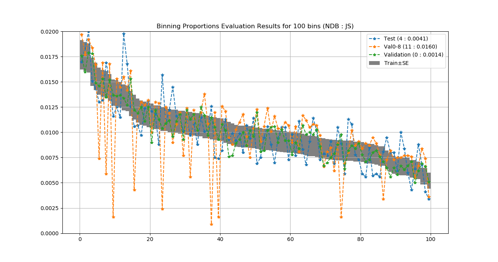
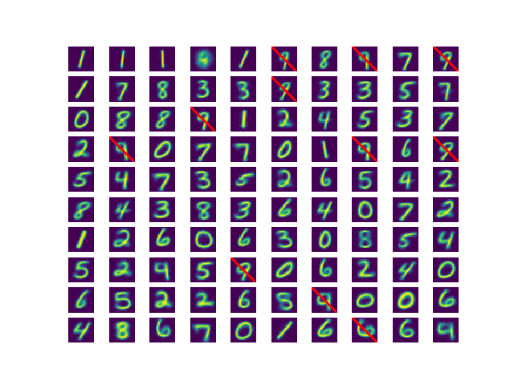
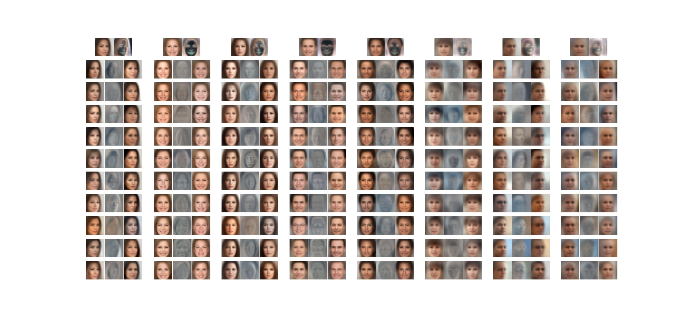
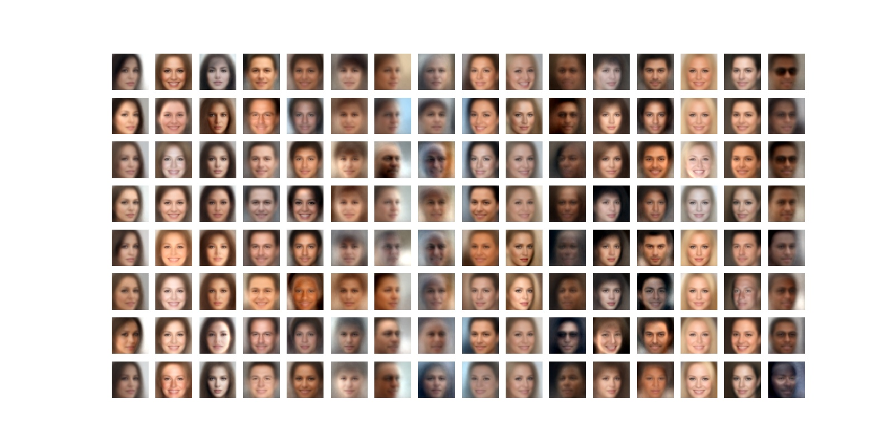
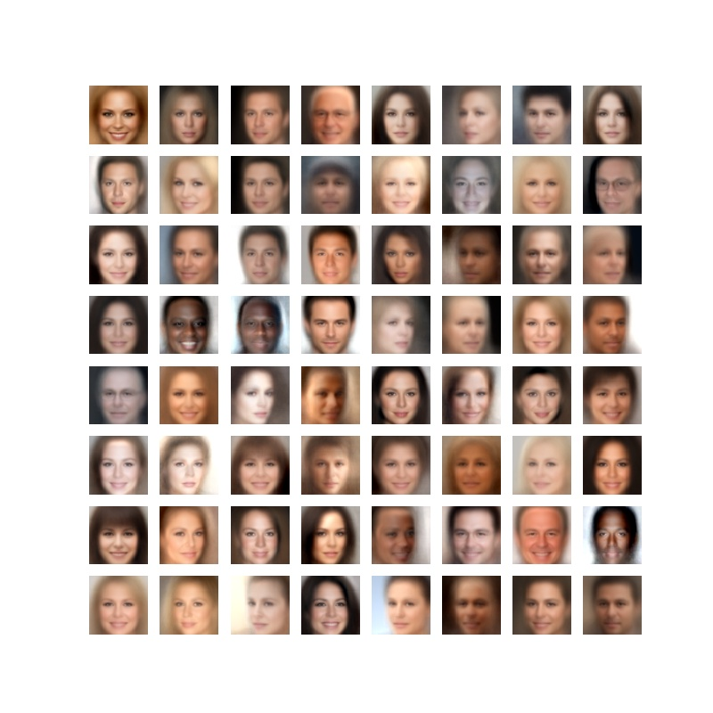
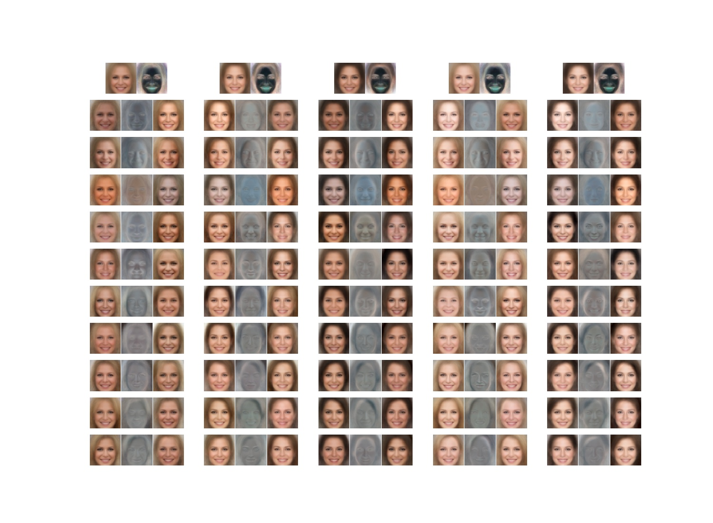
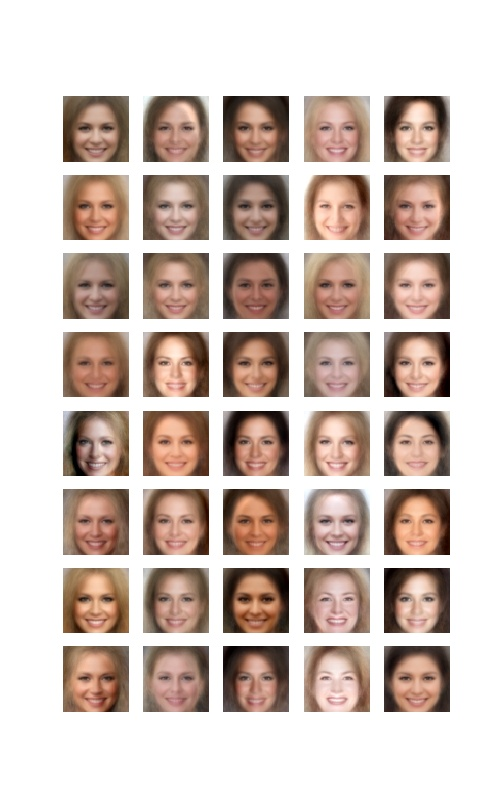
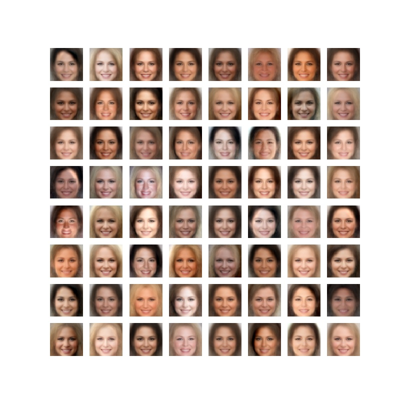

On GANs and GMMs
================
Implementation of *NDB* and *MFA* per NeurIPS 2018 paper [On GANs and GMMs](https://arxiv.org/abs/1805.12462) by Eitan Richardson and Yair Weiss.

*Check out our new pytorch implementation [here](https://github.com/eitanrich/torch-mfa).*

**NDB**: An evaluation method for high-dimensional generative models  
**MFA**: Mixture of Factor Analyzers for modeling high-dimensional data (e.g. full images)

### TODO:
- [x] NDB code cleanup
- [x] MNIST demo for NDB
- [x] MFA model cleanup
- [ ] Inference code
- [ ] Sharpness measure code

### Prerequisites

- Python 3.x, NumPy, SciPy, Sklearn, TensorFlow

### Demo Scripts

- `ndb_mnist_demo.py`: A small stand-alone demo for NDB evaluation using MNIST (compare train, val, test and simulated biased model)
- `mfa_train_mnist/celeba.py`: Training an MFA model for MNIST/CelebA
- `mfa_eval_mnist/celeba.py`: Evaluating the trained MFA model

## Running the Standalone NDB MNIST Demo
- Download and extract MNIST from http://yann.lecun.com/exdb/mnist/ to `./data/mnist` (should contain 4 `ubyte` files)
- Run `python3 ndb_mnist_demo.py`:

The resulting binning histogram, and NDB (Number of statistically Different Bins) and JS (Jensen-Shannon Divergence) values:



NDB evaluation on this toy example reveals that:
- A random validation split from the train data is statistically similar to the train data (NDB = 0, JS divergence = 0.0014)
- The MNIST test set is not coming from exactly the same distribution (different writers), but is pretty close (NDB = 4, JS divergence = 0.0041)
- NDB detects the distribution distortion in a deliberately biased set created by removing all digit 9 samples from the validation set (NDB = 11, JS divergence = 0.016)

A plot showing the NDB bin centers and the statistically-different bins (with significance level = 3 standard-errors) in the simulated Val0-8 evaluated set. 
All bins corresponding to digit 9 are detected as statistically-different (marked in red).



**The NDB test can be used to evaluate different generative models (e.g. GANs). In our paper, we demonstrate its performance on three datasets - CelebA, SVHN and MNIST.**

## Training MFA on CelebA

First, download the CelebA dataset from <http://mmlab.ie.cuhk.edu.hk/projects/CelebA.html> into some folder (default location is ../../Datasets/CelebA/).
The CelebA folder should contain the subfolder img_align_celeba (containing all aligned and cropped images) and the text file list_eval_partition.txt.

Run `python3 mfa_train_celeba.py` ...

By Default, the script learns a Mixture of Factor Analyzers with 200 components and then breaks each component to additional components.
While running, the code generates some plots that are also saved to the output folder (sorry, no TensorBoard...):

The first few components, showing each component mean, noise std and column-vectors of the scale matrix:



Random samples drawn from each component separately:



Random samples from the mixture:



The test log-likelihood progress:

### Sub-components training

After training the main (root) components, the script continues to train sub-components (training is done hierarchically due to GPU memory limitations).

Below are examples for images generated for sub-components of one of the root components:

Components directions:



Random samples drawn from each sub-component separately:



Random samples from the mixture:



The test log-likelihood progress:

## The MFA Implementation

`mfa_train_celeba.py` is a script that runs the training process.

The `utils` directory contains the interesting stuff:
- `mfa.py` is a python class implementing the CPU version of MFA (inference-only - no training)
- `mfa_tf.py` contains TensorFlow implementation of relevant MFA functionality, for example:
    - `get_log_likelihood()`: calculates the log-likelihood of a batch of samples given the MFA model parameters.
- The actual training code in TensorFlow is in `mfa_sgd_training.py`. The two most important lines are:
```
    G_loss = -1.0 * mfa_tf.get_log_likelihood(X, *theta_G)
    G_solver = tf.train.AdamOptimizer(learning_rate=learning_rate).minimize(G_loss, var_list=theta_G)
```


## Training MFA on your own dataset

Most of the MFA code should be generic enough to support different datasets. Each data sample is flattened and represented as a (row) vector of floats. The interface to specific datasets is `image_batch_provider.py`. The current implementation supports CelebA, MNIST and SVHN. There are two options to support other datasets:
1. Modify `image_batch_provider.py`: A small dataset can be preloaded like MNIST. Large datasets should be treated like CelebA, where only an image list is preloaded.
2. Implement your own version of a data provider, exposing a similar API to `image_batch_provider.py` (i.e. `m_train_images, num_test_images, get_next_minibatch_samples(), get_test_samples(test_size)`

